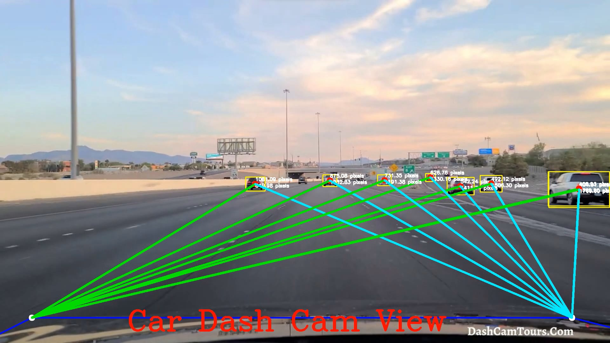

𝐄𝐧𝐬𝐮𝐫𝐢𝐧𝐠 𝐑𝐨𝐚𝐝 𝐒𝐚𝐟𝐞𝐭𝐲 𝐰𝐢𝐭𝐡 𝐂𝐨𝐦𝐩𝐮𝐭𝐞𝐫 𝐕𝐢𝐬𝐢𝐨𝐧

Thrilled to showcase my latest project focused on enhancing road safety through computer vision!

Steps For This Project:

1. Install Ultalytics
   - pip install ultralytics
2. Download a video for processing.
3. Download and run point_distance.py

𝐊𝐞𝐲 𝐅𝐞𝐚𝐭𝐮𝐫𝐞𝐬:

𝐃𝐢𝐬𝐭𝐚𝐧𝐜𝐞 𝐃𝐞𝐭𝐞𝐜𝐭𝐢𝐨𝐧: Implemented a robust computer vision system to calculate the distance between vehicles on the road.
𝐒𝐚𝐟𝐞𝐭𝐲 𝐓𝐡𝐫𝐞𝐬𝐡𝐨𝐥𝐝𝐬: Set up thresholds to identify unsafe distances between vehicles.
𝐀𝐮𝐭𝐨𝐦𝐚𝐭𝐞𝐝 𝐒𝐚𝐟𝐞𝐭𝐲 𝐌𝐞𝐚𝐬𝐮𝐫𝐞𝐬: When the distance falls below a critical threshold, the system triggers safety precautions, such as automatic braking for deceleration.

𝐑𝐞𝐬𝐮𝐥𝐭𝐬:

- Effective detection and calculation of distances in real-time.
- Proactive safety measures to prevent potential collisions.
- Contributing to the development of advanced driver-assistance systems.

𝐈𝐦𝐩𝐚𝐜𝐭:

This project marks a step forward in leveraging computer vision for proactive safety measures on the road. Imagine the potential for reducing accidents and ensuring smoother traffic flow!

The output will look like

